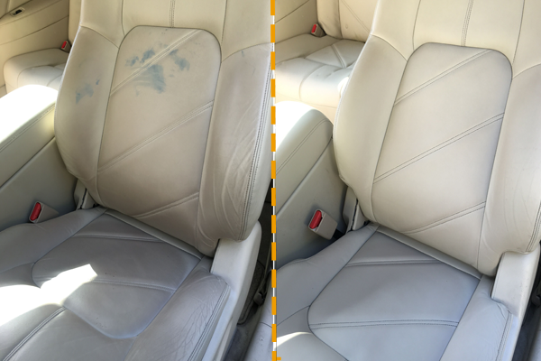
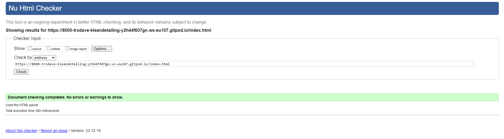
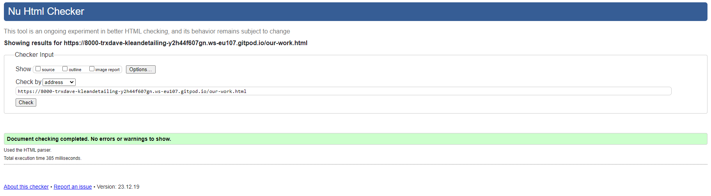
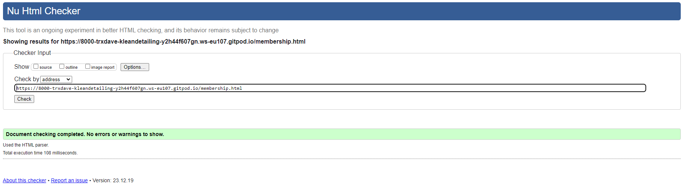
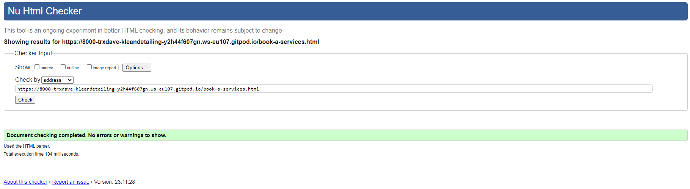
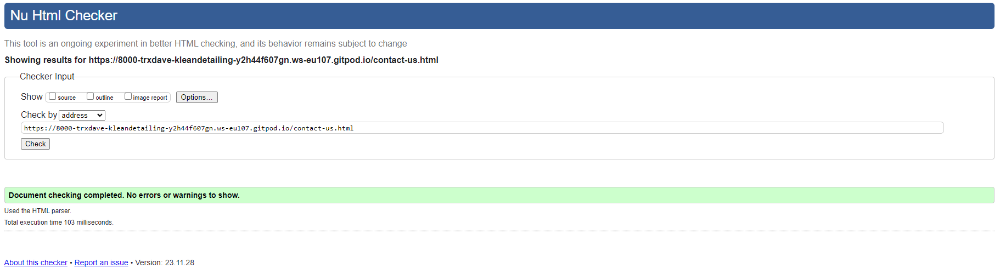

# kleandetailing
I use hand drawing for layout Heading,body,section,footer.

I use color space on website to pick out the color matching palette. 
https://mycolor.space/?hex=%23A38A09&sub=1

## Navigation Bar:
3 pages bar includes links to the logo, Home, Our Works, Book a Services, Contact Us
Section will easy navigate from page to page across all devices

## index Page Image:
Photograph with overlay user able to see get in touch Today.

## Home Decription:
Car wash, valeting, and detailing services play crucial roles in maintaining a vehicle's appearance. Car washes focus on exterior cleaning,
valeting involves a more comprehensive interior and exterior cleaning, while detailing delves into meticulous cleaning, restoration, and protection,
often including paint correction and fine detailing. Each service caters to different customer preferences and vehicle care needs.

## 4 Column: 
Show Bronze Valet, Silver Valet, Gold Valet and Platinum Valet with pricing and what item on the list.

## Footer: 
Footer section includes address detailing, Navigation - Home, Our Works, and Contact Us.  Social media includes.

## Our Work Decription:
Klean detailing involves the thorough cleaning and restoration of a vehicle, both inside and out. Car detailers use various cleaning products, tools, and techniques to enhance a vehicle's appearance and condition. Their services range from basic washes to intensive cleaning jobs. Detailers clean automotive interiors, addressing aspects like upholstery, dashboard, and windows, as well as exteriors, focusing on paintwork, wheels, and other exterior components. They may also apply protective measures like waxing and sealing on the vehicle's exterior to maintain its shine and protect it from environmental elements. Klean detailing goes beyond a standard car wash, offering more personalized and comprehensive cleaning packages. Detailers pay attention to every detail, ensuring the vehicle looks as close to new as possible.

## Polishing: 
Polishing in car detailing is a process that involves the use of specialized compounds and abrasive pads to remove minor imperfections from a vehicle's paint surface. It aims to restore and enhance the paint's gloss by eliminating swirl marks, light scratches, and oxidation. The technique results in a smoother and shinier finish.

## Paint Correction: 
Paint correction is a more advanced and comprehensive process focused on restoring the integrity of a vehicle's paintwork. It addresses moderate to severe imperfections such as deeper scratches, heavy swirl marks, and other defects. This multi-stage process typically uses various grades of abrasive compounds and polishing techniques to achieve a flawless, defect-free finish.

Both polishing and paint correction contribute to enhancing the aesthetic appearance of a vehicle's paint, providing a more vibrant and polished look. These processes are often part of professional car detailing services.

## Headlight Restoration:
Headlight restoration is a process designed to renew and enhance the clarity of vehicle headlights, typically made of plastic. Over time, exposure to environmental factors like UV rays, road debris, and harsh weather conditions can cause headlights to become cloudy, yellowed, or hazy. The restoration process involves various techniques and products to eliminate this deterioration, improving both the aesthetic appearance of the headlights and the safety of nighttime driving.

## Leather Restoration:
Leather restoration in car wash detailing refers to the process of rejuvenating and enhancing the condition of a vehicle's leather interior. This specialized service aims to address various issues that leather surfaces may face over time, including wear, fading, stains, and cracking. Car detailing professionals use specific techniques and products designed for leather care to restore the leather to its original or near-original state.

## Footer: 
Footer section includes logo, address detailing, Navigation - Home, Our Works, and Contact Us.  Social media includes.

# Book a Services:
List of item Bronze, Silver, Gold and Platinum.
Extra of items.
Calendar to add in for available appointments and Click a button submit.
Foot section includes logo, address detailing, Navigation - Home, Our Works, Book a Services and Contact Us. Social Media includes.

## Contact Us Form:

First name, Email Address, Mobile Number and your message. Click Button Message Sent.
Foot section includes logo, address detailing, Navigation - Home, Our Works, Book a Services and Contact Us. Social Media includes.

# Validator:

## Index:

## Our Work:

## Join our membership:

## Book a Services:

## Contact Us:

