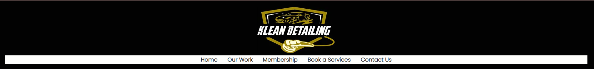

# Klean Detailing

## Am I Responsive?

Visit the deployed website (https://trxdave.github.io/kleandetailing/)

## UX

### Project

* Show the price of different types of Valeting.

* Booking a Services online.

* Contact Us.

* Show what our work job doing.

* Optimize the website for search engines to increase visibility and attract customers.

### Color

The colours used in the site are black (#020202), Dark Goldenrod (#A38A09), Baby powder (#FEFEFC) and Raisin black (#272727).

I used [coolors.co](https://coolors.co/020202-a38a09-fefefc-272727) to generate my colour palette.

### Text

I use google font website (https://fonts.google.com/)

Poppins are used for all sites but the logo are different text used by Photoshop text and designed by me in 2022.

### Logo

I designed the logo back in 2022. (assets/image/logo.webp)

### Wireframes

Balsamiq - I could not use this. I used the design on my a4 pad for 5 pages of layout heading, body, div, column, section, footer.

## 2. Features

### General

### Header with Navigation Bar

* The header contains the business logo top of the screen.
* 5 pages bar includes links to the Home, Our Works, Membership, Book a  Services, Contact Us. The section will easily navigate from page to page across all devices.

 

   
### Footer

* The footer includes a logo, location address and social media channels.

 

### Landing Page

* Hero Image is designed to attract the customer's attention with a car wash.

 

### Info Section

* Information car wash, valeting and detailing.

 
    

### Column Section

* We are allowing the customer to read what the business has to offer.
* Show Bronze Valet, Silver Valet, Gold Valet and Platinum Valet with pricing and what item on the list.

 
    

### Our Work

* We are allowing the customer to read what involves cleaning and restoration of a vehicle, both inside and out.

 
    

### Polishing/Paint Correction

* We are allowing the customer to read what involves polishing/paint correction.

 
    

### Headlight Restoration

* We are allowing the customer to read what involves headlight restoration.

 
    
### Leather Restoration

* We are allowing the customer to read what involves leather restoration.

 
    
### Join our Membership

* We are allowing the customer to join our membership for a year to get discounts all year round on products and services.

 
    
### Book a Services

* We are allowing show the customer what valet involves and extra.
 

* The form allows customer to book a services, book a reservation on a specific date. 

 
    
* I did make a calendar but it is not working for me and no time for it that I need learn more about what date is available and what is not available. I change input instead of calendar.

### Contact Us

* The form allows customers to contact us.

 
    

## 3. Testing:

### Code Validator:

I have used the recommended HTML W3C Validator (https://validator.w3.org) to validate all of my HTML files.

| Directory | File | Screenshot | Notes |
| --- | --- | --- | --- |
|  | book-a-services.html |  | There were no syntax errors. |
|  | contact-us.html |  |  There were no syntax errors. |
|  | index.html |  | There were no syntax errors. |
|  | membership.html |  | There were no syntax errors. |
|  | our-work.html |  | There were no syntax errors. |

## Am I Responsive:

### Am I Responsive?

* Used to check responsiveness of the site pages across different devices.

(https://ui.dev/amiresponsive)

    

### Accessibility:

* Used Lighthouse in Chrome to confirm that the colours and fonts used and website are easy to read and accessible.

### W3C CSS Validator

I have used the recommended [CSS Jigsaw Validator](https://jigsaw.w3.org/css-validator) to validate all of my CSS files.

| Directory | File | Screenshot | Notes |
| --- | --- | --- | --- |
| assets | style.css |  | There were no errors.

### Browser Compatibility

I've tested my deployed project on multiple browsers to check for compatibility issues.

| Browser | Home | Our Work | Membership | Book a Services | Contact Us | Notes |
| --- | --- | --- | --- | --- | --- |
| Chrome |  |  |  |  |  | Works as expected |
| Edge |  |  |  |  |  |  Works as expected |
| Brave |  |  |  |  |  | Works as expected |

## 4. Deployment:

### GitHub

* This website was developed using Codeanywhere but there was problem and I have to change to GitHub.

    (https://github.com/trxdave/kleandetailing)

## 5. Credit:

### Media

* Logo: Designed by me in 2022

* Hero image: Car wash by Luke Miller

* Pexels (https://www.pexels.com/photo/close-up-shot-of-a-car-wheel-during-car-wash-14231678/)
    
* Polishing/Paint Correction, Headlight Restoration, Leather Restoration images

Instagram image (https://www.instagram.com/kleandetailing2022/)

* Join Out Membership: Image by Luke Miller

Pexels (https://www.pexels.com/photo/a-person-polishing-the-car-s-body-14231701/)

* Contact Us: Image by Luke Miller

Pexels (https://www.pexels.com/photo/man-washing-his-car-14231676/)

### Code

* W3Schools - I used this regularly. (https://www.w3schools.com/)
* Flexbox Froggy - Got all level 24 of 24. (https://flexboxfroggy.com/)
* ColorZilla - I use this colour coding. (https://www.colorzilla.com/chrome/)
* Font awesome - I used social media for icons with color (https://fontawesome.com/)
